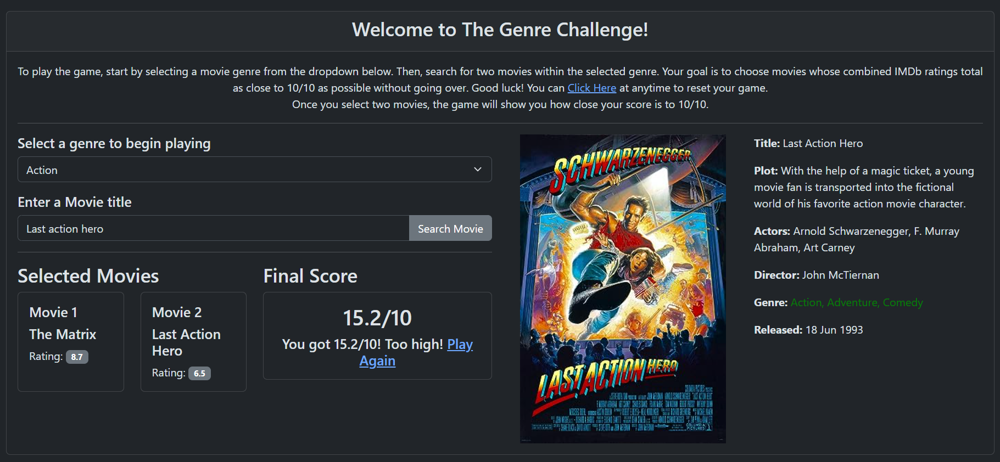

# The Genre Challenge

## About the Game
"The Genre Challenge" is an interactive web-based game where players test their movie genre knowledge. The game revolves around selecting movies within specified genres and trying to match their combined IMDb ratings as close to 100% as possible without exceeding it.

## How to Play
1. **Select a Movie Genre**: Start by choosing a genre from the dropdown list. The genres range from Action to Western, encompassing a wide variety of choices.

2. **Search for Movies**: Once a genre is selected, search for movies within that genre. You'll need to use your knowledge or best guess to pick movies that, when combined, have IMDb ratings close to 100%.

3. **Choose Two Movies**: Select two movies from your search results. Their combined IMDb ratings are calculated and displayed.

4. **Score Calculation**: Your goal is to get as close to a 100% score as possible. The score is the sum of the IMDb ratings of the two selected movies.

5. **Winning the Game**: If your combined score is exactly 100%, you win! If it's less, you can try again, but if it's more, you've gone over and lose the round.

## Live Version
You can play "The Genre Challenge" live at [Your Live Site URL](#).

## Features
- Responsive design for playing on various devices.
- Wide range of movie genres to choose from.
- Live IMDb score calculation.
- Interactive and user-friendly UI.

## Local Setup
If you want to run the game locally:
1. Clone the repository to your local machine.
2. `cd` into the project directory.
3. Run `npm install` to install all dependencies.
4. Run `npm start` to start the local server.
5. Open your browser and go to `http://localhost:3000` (or the port provided in your terminal).

## Contributing
Contributions to "The Genre Challenge" are welcome! If you have suggestions or improvements, feel free to fork the repo and submit a pull request.

## License
This project is licensed under the [MIT License](LICENSE).

## Acknowledgements
Thanks to all the movie enthusiasts and developers who contributed to this project!